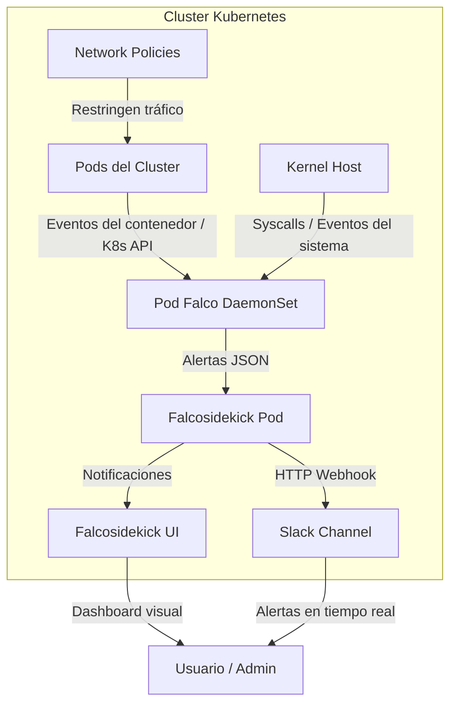

# 🧠 Falco + Network Policies (Runtime Security)

## 📘 Descripción del Proyecto

Este proyecto implementa un entorno de **seguridad en Kubernetes** utilizando **Falco con UI (Falcosidekick UI)**,  y **Network Policies** en un clúster desplegado sobre **Rocky Linux** en el cual las alertas generadas por **Falco** se mostraran tanto en el **Dashboard** como en una aplicacion de terceros como lo es **Slack**.

El objetivo principal es **detectar comportamientos anómalos y controlar la comunicación entre pods**, garantizando un entorno seguro y monitoreado.

Falco actúa como un **IDS (Intrusion Detection System)** en tiempo real para contenedores y Kubernetes, mientras que las **Network Policies** limitan el tráfico entre pods para minimizar la superficie de ataque.  
El proyecto incluye además **reglas personalizadas (Custom Rules)** que permiten ajustar el comportamiento de Falco a los requerimientos específicos del entorno.

---

## 🏗️ Arquitectura del Proyecto

### 🔹 Componentes principales:

| Componente | Función |
|-------------|----------|
| **Falco DaemonSet** | Monitorea los eventos del kernel en cada nodo del clúster |
| **Falcosidekick** | Recibe las alertas de Falco y las reenvía a integraciones externas (Slack, UI, etc.) |
| **Falcosidekick UI** | Panel visual donde se muestran las alertas en tiempo real |
| **Slack Integration** | Notificaciones inmediatas en un canal de Slack |
| **Network Policies** | Restringen el tráfico entre pods para prevenir movimientos laterales |
| **Custom Rules** | Reglas personalizadas para detectar comportamientos específicos |

### 🔹 Diagrama de arquitectura

### 🔹 Prerrequisitos
| Requisito                           | Descripción                                    |
| ----------------------------------- | ---------------------------------------------- |
| **Sistema Operativo**               | Rocky Linux 9 o superior                       |
| **Kubernetes**                      | v1.28+ (instalado y funcionando)               |
| **kubectl**                         | Configurado para acceder al clúster            |
| **Helm**                            | v3 o superior                                  |
| **Falcoctl (opcional)**             | Para manejar reglas de Falco                   |
| **Conexión a Internet**             | Para descargar charts e imágenes de contenedor |
| **Permisos administrativos (sudo)** | Requeridos para instalación                    |

### 🔹 Instalación
#instalar HELM

curl https://raw.githubusercontent.com/helm/helm/main/scripts/get-helm-3 | bash
-------------------------------
##INSTALACION DE FALCO Y FALCO UI
# Nodo worker 1
ssh k8s-worker01 'sudo mkdir -p /mnt/data/redis && sudo chmod 777 /mnt/data/redis'

# Nodo worker 2
ssh k8s-worker02 'sudo mkdir -p /mnt/data/redis && sudo chmod 777 /mnt/data/redis'

kubectl apply -f storage_manifests.yaml

kubectl get storageclass
kubectl get pv

# Agregar el repositorio de Falco
helm repo add falcosecurity https://falcosecurity.github.io/charts
helm repo update

helm install falco falcosecurity/falco \
  -n falco \
  -f falco-values.yaml

kubectl port-forward -n falco svc/falco-falcosidekick-ui 2802:2802 --address=0.0.0.0

-------------------------------------
#Actualizar Reglas
helm upgrade falco falcosecurity/falco \
  -n falco \
  -f falco-values.yaml

#Ver que se actualizan los nodos
kubectl rollout status daemonset -n falco falco

#network police#
# 1. Crear y etiquetar namespace
kubectl create namespace production
kubectl label namespace production name=production

kubectl apply -f netpol_default_deny.yaml

chmod +x netpol_quick_test.sh
./netpol_quick_test.sh

### 🔹 Configuración explicada

⚙️ Configuración

Falco Rules Path: /etc/falco/rules.d/

Custom Rules Mount: Se monta el ConfigMap falco-custom-rules

Logs: se visualizan con kubectl logs -n falco <falco-pod>

Falco UI: se expone por NodePort en el puerto 30080

### 🔹 Comandos de validación

kubectl get pods -n falco

kubectl logs -n falco -l app=falco

kubectl run test-nc --image=alpine --restart=Never -it -- nc 1.1.1.1 80

kubectl exec -it <otro-pod> -- wget -qO- backend:8080
