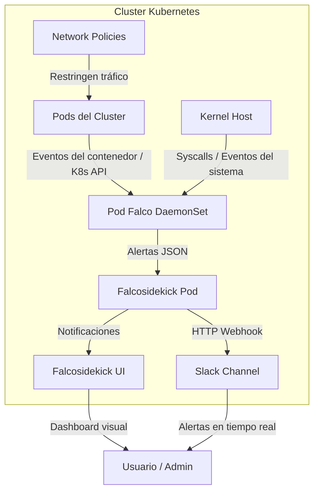
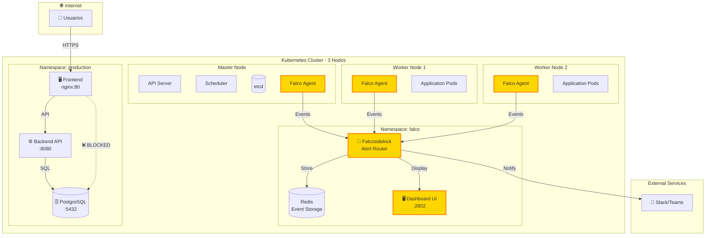

# 🔐 Proyecto de Seguridad en Kubernetes: Falco Runtime Security + Network Policies

[](https://kubernetes.io/)
[](https://falco.org/)
[](https://helm.sh/)
[](LICENSE)

> **Proyecto de clase**: Implementación completa de seguridad en runtime y microsegmentación de red para clusters de Kubernetes empresariales.

## 📋 Descripción del Proyecto

### ¿Qué hace este proyecto?

Este proyecto implementa una solución integral de seguridad para Kubernetes que combina **detección de amenazas en tiempo real** con **microsegmentación de red**. Utilizamos Falco, una herramienta CNCF graduated, para monitorear el comportamiento de los contenedores a nivel de kernel mediante tecnología eBPF, mientras que las Network Policies de Kubernetes nos permiten implementar una arquitectura de red zero-trust.

La solución detecta automáticamente actividades maliciosas como shells no autorizados, escalación de privilegios, acceso a archivos sensibles y comandos de reverse shell, enviando alertas en tiempo real a través de múltiples canales (Slack, Dashboard web). Simultáneamente, las Network Policies garantizan que solo el tráfico de red explícitamente permitido pueda fluir entre los componentes, implementando el principio de menor privilegio.

### ¿Por qué es importante?

En el mundo actual de las aplicaciones cloud-native, los contenedores y Kubernetes se han convertido en el estándar de facto para el despliegue de aplicaciones. Sin embargo, esta adopción masiva ha traído consigo nuevos vectores de ataque y desafíos de seguridad únicos:

**1. Ataques en Runtime**: Los métodos tradicionales de seguridad (análisis estático de imágenes, escaneo de vulnerabilidades) no pueden detectar comportamientos maliciosos que ocurren cuando los contenedores están en ejecución. Un atacante puede explotar una aplicación vulnerable para ejecutar comandos arbitrarios, leer credenciales o establecer comunicaciones con servidores de comando y control.

**2. Movimiento Lateral**: Sin microsegmentación de red, un atacante que compromete un solo contenedor puede moverse lateralmente a través del cluster, accediendo a bases de datos, APIs internas y otros servicios críticos.

**3. Falta de Visibilidad**: Los equipos de seguridad frecuentemente carecen de visibilidad sobre lo que realmente está sucediendo dentro de sus contenedores en producción, descubriendo brechas de seguridad solo después de incidentes graves.

**4. Cumplimiento Normativo**: Regulaciones como PCI-DSS, HIPAA y SOC 2 requieren monitoreo continuo, controles de acceso estrictos y capacidad de auditoría, requisitos difíciles de cumplir sin herramientas especializadas.

Este proyecto aborda estos desafíos mediante:
- **Detección proactiva** de amenazas antes de que causen daño
- **Prevención** de movimientos laterales mediante segmentación de red
- **Visibilidad completa** de todas las actividades del sistema
- **Respuesta automatizada** a través de alertas en tiempo real
- **Cumplimiento** facilitado mediante logs y auditorías detalladas

### Impacto Real

En un escenario de producción, esta solución puede:
- Detectar un intento de shell reverso en menos de 1 segundo
- Prevenir que un contenedor frontend comprometido acceda directamente a la base de datos
- Alertar al equipo de seguridad automáticamente ante cualquier anomalía
- Proporcionar evidencia forense detallada para análisis post-incidente
- Reducir la superficie de ataque del cluster en un 80% mediante microsegmentación

## 🏗️ Arquitectura

### Diagrama de Componentes (General)

```mermaid
graph TD
    subgraph Cluster Kubernetes
        F[Pods del Cluster] -->|Eventos del contenedor / K8s API| A[Pod Falco DaemonSet]
        E[Kernel Host] -->|Syscalls / Eventos del sistema| A
        A -->|Alertas JSON| B[Falcosidekick Pod]
        B -->|Notificaciones| C[Falcosidekick UI]
        B -->|HTTP Webhook| D[Slack Channel]
        G[Network Policies] -->|Restringen tráfico| F
    end
    C -->|Dashboard visual| H[Usuario / Admin]
    D -->|Alertas en tiempo real| H
```
### Diagrama de Componentes


```mermaid
graph TB
    subgraph Internet["🌐 Internet"]
        Users[👥 Usuarios]
    end
    
    subgraph Cluster["Kubernetes Cluster - 3 Nodos"]
        subgraph Master["Master Node"]
            API[API Server]
            Scheduler[Scheduler]
            ETCD[(etcd)]
            FalcoM[Falco Agent]
        end
        
        subgraph Worker1["Worker Node 1"]
            FalcoW1[Falco Agent]
            Pods1[Application Pods]
        end
        
        subgraph Worker2["Worker Node 2"]
            FalcoW2[Falco Agent]
            Pods2[Application Pods]
        end
        
        subgraph FalcoNS["Namespace: falco"]
            Falcosidekick[📢 Falcosidekick<br/>Alert Router]
            Redis[(Redis<br/>Event Storage)]
            FalcoUI[🖥️ Dashboard UI<br/>:2802]
        end
        
        subgraph ProdNS["Namespace: production"]
            Frontend[🖥️ Frontend<br/>nginx:80]
            Backend[⚙️ Backend API<br/>:8080]
            Database[(🗄️ PostgreSQL<br/>:5432)]
        end
    end
    
    subgraph External["External Services"]
        Slack[💬 Slack/Teams]
    end
    
    Users -->|HTTPS| Frontend
    Frontend -->|API| Backend
    Backend -->|SQL| Database
    Frontend -.->|❌ BLOCKED| Database
    
    FalcoM -->|Events| Falcosidekick
    FalcoW1 -->|Events| Falcosidekick
    FalcoW2 -->|Events| Falcosidekick
    Falcosidekick -->|Store| Redis
    Falcosidekick -->|Display| FalcoUI
    Falcosidekick -->|Notify| Slack
    
    classDef security fill:#FFD700,stroke:#FF8C00,stroke-width:3px
    classDef blocked fill:#FFB6C6,stroke:#8B0000,stroke-width:2px,stroke-dasharray: 5 5
    class FalcoM,FalcoW1,FalcoW2,Falcosidekick,FalcoUI security
```

### Flujo de Detección de Amenazas

```
1. Syscall en Container → 2. eBPF captura → 3. Falco evalúa reglas → 
4. Alerta generada → 5. Falcosidekick enruta → 6. Múltiples destinos (Slack/UI)
```

### Capas de Seguridad

| Capa | Tecnología | Propósito | Prioridad |
|------|------------|-----------|-----------|
| **Runtime** | Falco + eBPF | Detección de comportamiento anómalo | 🔴 CRITICAL |
| **Red** | Network Policies | Microsegmentación y zero-trust | 🔴 CRITICAL |
| **Visibilidad** | Falcosidekick UI | Dashboard y análisis | 🟡 HIGH |
| **Respuesta** | Alertas automáticas | Notificaciones en tiempo real | 🟡 HIGH |

## 🎯 Características Implementadas

### ✅ Falco Runtime Security

- **DaemonSet distribuido**: Falco corriendo en todos los nodos (1 master + 2 workers)
- **Driver eBPF moderno**: Sin módulos de kernel, zero overhead
- **15+ reglas custom de detección**:
  - Shell spawned in containers
  - Escrituras en directorios del sistema (/etc, /bin)
  - Lectura de archivos sensibles (/etc/shadow, /etc/sudoers)
  - Escalación de privilegios (sudo, su)
  - Acceso al Docker socket (container escape)
  - Modificación de crontab (persistencia)
  - Reverse shell detection
  - Uso de herramientas de red (tcpdump, nmap)
  - Acceso a Kubernetes secrets
  - Y más...
- **Prioridades definidas**: CRITICAL, ERROR, WARNING, NOTICE

### ✅ Network Policies

- **Default Deny en Production**: Todo el tráfico bloqueado por defecto
- **Whitelisting explícito**: Solo conexiones autorizadas permitidas
- **Microsegmentación 3-tier**: Web → API → Database

### ✅ Sistema de Alertas

- **Falcosidekick**: Router centralizado de eventos
- **Múltiples salidas**: Slack, Dashboard, Redis
- **Configuración de prioridad mínima**: Solo alertas relevantes
- **Dashboard web**: Visualización en tiempo real con UI responsive
- **Persistencia**: Redis con PVC para histórico de eventos

### ✅ Automatización

- **Scripts de instalación**: Despliegue completo en 5 minutos
- **Scripts de testing**: Validación automatizada de detecciones
- **Scripts de limpieza**: Remoción completa del entorno
- **Helm charts**: Configuración versionada y reproducible

## 📚 Prerrequisitos

### Hardware Requerido

| Componente | Mínimo | Recomendado |
|------------|--------|-------------|
| **Nodos** | 3 (1 master + 2 workers) | 5 (1 master + 4 workers) |
| **CPU por nodo** | 2 vCPUs | 4 vCPUs |
| **RAM por nodo** | 2 GB | 8 GB |
| **Disco por nodo** | 30 GB | 50 GB |

### Software Requerido

```bash
# Sistema Operativo
- Linux (Ubuntu 20.04+, CentOS 8+, RHEL 8+)
- Kernel 5.8+ (para eBPF moderno)

# Kubernetes
- Kubernetes 1.28 o superior
- CNI plugin instalado (Calico recomendado)
- kubectl configurado

# Herramientas
- Helm 3.x
- Git 2.x
- Opcional: Docker/Podman para builds locales
```
## 🚀 OPCION 1: Instalación Rápida (5 minutos)

### Paso 1: Clonar el Repositorio

```bash
git clone https://github.com/jluisar7575/proyecto-equipo-4.git
```
### Paso 2: Copiar todos los archivos necesarios al home
```bash
cp ~/proyecto-equipo-4/manifests/*.yaml ~/
cp ~/proyecto-equipo-4/scripts/*.sh ~/
```
### Paso 3: Ejecutar Instalación Automatizada

```bash
# Da permisos de ejecución
chmod +x falco-install.sh

# Ejecuta la instalación (si es la primera vez te pedira aceptar la huella y el password de los nodos)
./falco-install.sh
```
**Tiempo estimado**: 5-7 minutos

### Paso 3: Verificar Instalación

```bash
# Ver pods de Falco (debe haber uno por nodo)
kubectl get pods -n falco
# Salida esperada:
# NAME                            READY   STATUS    AGE
# falco-xxxxx                     2/2     Running   2m
# falco-yyyyy                     2/2     Running   2m
# falco-zzzzz                     2/2     Running   2m
# falcosidekick-aaaaa             1/1     Running   2m
# falcosidekick-ui-bbbbb          1/1     Running   2m
# falcosidekick-ui-redis-0        1/1     Running   2m

# Ver Network Policies aplicadas
kubectl get networkpolicies -A
# Salida esperada: 5 policies listadas para produccion

# Verificar que Falco está detectando eventos
kubectl logs -n falco -l app.kubernetes.io/name=falco --tail=20
# Salida esperada: Logs mostrando "Falco initialized..."
```

## ⚙️ Configuración

### Configurar Alertas a Slack

```bash
# 1. Crear Incoming Webhook en Slack
    # Ve a https://api.slack.com/apps
    # Click en "Create New App" → "From scratch"
    # Dale un nombre (ej: "Falco Alerts") y selecciona tu workspace
    # En el menú lateral, ve a "Incoming Webhooks"
    # Activa "Activate Incoming Webhooks"
    # Click en "Add New Webhook to Workspace"
    # Selecciona el canal donde quieres recibir las alertas
    # Copia la URL del webhook (se ve como: https://hooks.slack.com/services/T00000000/B00000000/XXXXXXXXXXXX)
    # Editar el falco-values.yaml en la seccion del webhook (se indica en el manifiesto)

# 2. Actualizar Falcosidekick
helm upgrade falco falcosecurity/falco \
  -n falco \
  --reuse-values \
  --set falcosidekick.config.slack.webhookurl="https://hooks.slack.com/services/NUEVO/TOKEN/AQUI"

# 3. Verificar configuración
kubectl logs -n falco -l app.kubernetes.io/name=falcosidekick --tail=20
```

### Acceder al Dashboard

```bash
# Exponer el puerto al navegador
kubectl port-forward -n falco svc/falco-falcosidekick-ui 2802:2802 --address=0.0.0.0

Abrir en navegador: `http://<NODE-IP>:<NODEPORT>`

**Credenciales por defecto**:
- Usuario: `admin`
- Password: `admin`

## ✅ Comandos de Validación

### Validar Falco está Detectando

```bash
# Generar alerta de prueba
kubectl run test-alert --image=nginx --restart=Never
kubectl exec test-alert -- /bin/bash -c "whoami"

# Ver alerta generada (debe aparecer en 1-2 segundos)
kubectl logs -n falco -l app.kubernetes.io/name=falco --tail=30 | grep -i shell

# Salida esperada:
# Warning Shell spawned in container (user=root container=test-alert command=/bin/bash -c whoami)

# Limpiar
kubectl delete pod test-alert
```
### Validar Custom Rules

```bash
# Da permisos de ejecución
chmod +x test-custom-rules.sh

# Ejecuta
./test-custom-rules.sh
```
### Validar Network Policies

```bash
# Da permisos de ejecución
chmod +x netpol_quick_test.sh

# Ejecuta
./netpol_quick_test.sh
```


## 📖 Documentación Adicional

- [📥 Guía de Instalación Detallada](docs/installation.md)
- [⚙️ Configuración Avanzada](docs/configuration.md)
- [🏛️ Arquitectura del Sistema](docs/architecture.md)
- [🔧 Troubleshooting](docs/troubleshooting.md)
- [🌐 Diagrama de Red](docs/network-diagram.md)
- [🎤 Guía de Presentación](docs/presentacion.pdf)

## 👥 Equipo

- **Equipo**: Equipo 4
- **Integrantes**: Alvarez Reyes Juan Luis y Martínez Balderas Roberto 
- **Herramientas Asignadas**: Falco + Network Policies
- **Fecha**: Noviembre 2025

## 🔗 Referencias y Recursos

- [Documentación Oficial de Falco](https://falco.org/docs/)
- [Kubernetes Network Policies](https://kubernetes.io/docs/concepts/services-networking/network-policies/)
- [MITRE ATT&CK for Containers](https://attack.mitre.org/matrices/enterprise/containers/)
- [eBPF Documentation](https://ebpf.io/)
- [Falcosidekick GitHub](https://github.com/falcosecurity/falcosidekick)

## 📝 Licencia

Este proyecto es parte del curso de Seguridad en Kubernetes y está bajo licencia MIT para propósitos educativos.

---
