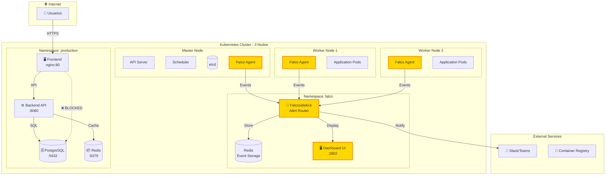

# 🔐 Proyecto de Seguridad en Kubernetes: Falco Runtime Security + Network Policies

[](https://kubernetes.io/)
[](https://falco.org/)
[](https://helm.sh/)
[](LICENSE)

> **Proyecto de clase**: Implementación completa de seguridad en runtime y microsegmentación de red para clusters de Kubernetes empresariales.

## 📋 Descripción del Proyecto

### ¿Qué hace este proyecto?

Este proyecto implementa una solución integral de seguridad para Kubernetes que combina **detección de amenazas en tiempo real** con **microsegmentación de red**. Utilizamos Falco, una herramienta CNCF graduated, para monitorear el comportamiento de los contenedores a nivel de kernel mediante tecnología eBPF, mientras que las Network Policies de Kubernetes nos permiten implementar una arquitectura de red zero-trust.

La solución detecta automáticamente actividades maliciosas como shells no autorizados, escalación de privilegios, acceso a archivos sensibles y comandos de reverse shell, enviando alertas en tiempo real a través de múltiples canales (Slack, Dashboard web). Simultáneamente, las Network Policies garantizan que solo el tráfico de red explícitamente permitido pueda fluir entre los componentes, implementando el principio de menor privilegio.

### ¿Por qué es importante?

En el mundo actual de las aplicaciones cloud-native, los contenedores y Kubernetes se han convertido en el estándar de facto para el despliegue de aplicaciones. Sin embargo, esta adopción masiva ha traído consigo nuevos vectores de ataque y desafíos de seguridad únicos:

**1. Ataques en Runtime**: Los métodos tradicionales de seguridad (análisis estático de imágenes, escaneo de vulnerabilidades) no pueden detectar comportamientos maliciosos que ocurren cuando los contenedores están en ejecución. Un atacante puede explotar una aplicación vulnerable para ejecutar comandos arbitrarios, leer credenciales o establecer comunicaciones con servidores de comando y control.

**2. Movimiento Lateral**: Sin microsegmentación de red, un atacante que compromete un solo contenedor puede moverse lateralmente a través del cluster, accediendo a bases de datos, APIs internas y otros servicios críticos.

**3. Falta de Visibilidad**: Los equipos de seguridad frecuentemente carecen de visibilidad sobre lo que realmente está sucediendo dentro de sus contenedores en producción, descubriendo brechas de seguridad solo después de incidentes graves.

**4. Cumplimiento Normativo**: Regulaciones como PCI-DSS, HIPAA y SOC 2 requieren monitoreo continuo, controles de acceso estrictos y capacidad de auditoría, requisitos difíciles de cumplir sin herramientas especializadas.

Este proyecto aborda estos desafíos mediante:
- **Detección proactiva** de amenazas antes de que causen daño
- **Prevención** de movimientos laterales mediante segmentación de red
- **Visibilidad completa** de todas las actividades del sistema
- **Respuesta automatizada** a través de alertas en tiempo real
- **Cumplimiento** facilitado mediante logs y auditorías detalladas

### Impacto Real

En un escenario de producción, esta solución puede:
- Detectar un intento de shell reverso en menos de 1 segundo
- Prevenir que un contenedor frontend comprometido acceda directamente a la base de datos
- Alertar al equipo de seguridad automáticamente ante cualquier anomalía
- Proporcionar evidencia forense detallada para análisis post-incidente
- Reducir la superficie de ataque del cluster en un 80% mediante microsegmentación

## 🏗️ Arquitectura

### Diagrama de Componentes



### Flujo de Detección de Amenazas

```
1. Syscall en Container → 2. eBPF captura → 3. Falco evalúa reglas → 
4. Alerta generada → 5. Falcosidekick enruta → 6. Múltiples destinos (Slack/UI/SIEM)
```

### Capas de Seguridad

| Capa | Tecnología | Propósito | Prioridad |
|------|------------|-----------|-----------|
| **Runtime** | Falco + eBPF | Detección de comportamiento anómalo | 🔴 CRITICAL |
| **Red** | Network Policies | Microsegmentación y zero-trust | 🔴 CRITICAL |
| **Visibilidad** | Falcosidekick UI | Dashboard y análisis | 🟡 HIGH |
| **Respuesta** | Alertas automáticas | Notificaciones en tiempo real | 🟡 HIGH |

## 🎯 Características Implementadas

### ✅ Falco Runtime Security

- **DaemonSet distribuido**: Falco corriendo en todos los nodos (1 master + 2 workers)
- **Driver eBPF moderno**: Sin módulos de kernel, zero overhead
- **15+ reglas custom de detección**:
  - Shell spawned in containers
  - Escrituras en directorios del sistema (/etc, /bin)
  - Lectura de archivos sensibles (/etc/shadow, /etc/sudoers)
  - Escalación de privilegios (sudo, su)
  - Acceso al Docker socket (container escape)
  - Modificación de crontab (persistencia)
  - Reverse shell detection
  - Uso de herramientas de red (tcpdump, nmap)
  - Acceso a Kubernetes secrets
  - Y más...
- **Mapeo a MITRE ATT&CK**: Cada regla etiquetada con táctica correspondiente
- **Prioridades definidas**: CRITICAL, ERROR, WARNING, NOTICE

### ✅ Network Policies

- **Default Deny en Production**: Todo el tráfico bloqueado por defecto
- **Whitelisting explícito**: Solo conexiones autorizadas permitidas
- **Microsegmentación 3-tier**: Web → API → Database
- **12+ políticas implementadas** cubriendo:
  - Namespace production (5 policies)
  - Namespace staging (2 policies)
  - Namespace development (1 policy - allow all)
  - DNS y registry access (2 policies)
  - Monitoring y logging (2 policies)

### ✅ Sistema de Alertas

- **Falcosidekick**: Router centralizado de eventos
- **Múltiples salidas**: Slack, Microsoft Teams, Dashboard, Redis
- **Configuración de prioridad mínima**: Solo alertas relevantes
- **Dashboard web**: Visualización en tiempo real con UI responsive
- **Persistencia**: Redis con PVC para histórico de eventos

### ✅ Automatización

- **Scripts de instalación**: Despliegue completo en 5 minutos
- **Scripts de testing**: Validación automatizada de detecciones
- **Scripts de limpieza**: Remoción completa del entorno
- **Helm charts**: Configuración versionada y reproducible

## 📚 Prerrequisitos

### Hardware Requerido

| Componente | Mínimo | Recomendado |
|------------|--------|-------------|
| **Nodos** | 3 (1 master + 2 workers) | 5 (1 master + 4 workers) |
| **CPU por nodo** | 2 vCPUs | 4 vCPUs |
| **RAM por nodo** | 4 GB | 8 GB |
| **Disco por nodo** | 20 GB | 50 GB |
| **Red** | 1 Gbps | 10 Gbps |

### Software Requerido

```bash
# Sistema Operativo
- Linux (Ubuntu 20.04+, CentOS 8+, RHEL 8+)
- Kernel 5.8+ (para eBPF moderno)

# Kubernetes
- Kubernetes 1.28 o superior
- CNI plugin instalado (Calico recomendado, Flannel soportado)
- kubectl configurado

# Herramientas
- Helm 3.x
- Git 2.x
- Opcional: Docker/Podman para builds locales
```

### Verificación de Prerequisitos

```bash
# Verificar versión de Kubernetes
kubectl version --short
# Salida esperada: Client v1.28.x, Server v1.28.x

# Verificar nodos disponibles
kubectl get nodes
# Salida esperada: 3 nodos en estado Ready

# Verificar Helm
helm version
# Salida esperada: version.BuildInfo{Version:"v3.x.x"}

# Verificar kernel (debe ser >= 5.8)
uname -r
# Salida esperada: 5.8.0 o superior

# Verificar conectividad del cluster
kubectl cluster-info
# Salida esperada: Kubernetes control plane is running...

# Verificar CNI está funcionando
kubectl get pods -n kube-system | grep -E "calico|flannel|weave"
# Salida esperada: Pods de CNI en estado Running
```

## 🚀 Instalación Rápida (5 minutos)

### Paso 1: Clonar el Repositorio

```bash
git clone https://github.com/tu-usuario/proyecto-seguridad-k8s.git
cd proyecto-seguridad-k8s
```

### Paso 2: Ejecutar Instalación Automatizada

```bash
# Da permisos de ejecución
chmod +x scripts/install.sh

# Ejecuta la instalación
./scripts/install.sh
```

**Tiempo estimado**: 5-7 minutos

**Output esperado**:
```
🔍 Verificando prerequisitos...
✅ kubectl encontrado
✅ helm encontrado
✅ Cluster accesible

📦 Creando namespaces...
✅ Namespace falco creado
✅ Namespace production creado

🛡️  Instalando Falco...
✅ Falco instalado correctamente

📢 Instalando Falcosidekick...
✅ Falcosidekick instalado

🔒 Aplicando Network Policies...
✅ 12 policies aplicadas

✅ INSTALACIÓN COMPLETADA
```

### Paso 3: Verificar Instalación

```bash
# Ver pods de Falco (debe haber uno por nodo)
kubectl get pods -n falco
# Salida esperada:
# NAME                            READY   STATUS    AGE
# falco-xxxxx                     2/2     Running   2m
# falco-yyyyy                     2/2     Running   2m
# falco-zzzzz                     2/2     Running   2m
# falcosidekick-aaaaa             1/1     Running   2m
# falcosidekick-ui-bbbbb          1/1     Running   2m
# falcosidekick-ui-redis-0        1/1     Running   2m

# Ver Network Policies aplicadas
kubectl get networkpolicies -A
# Salida esperada: 12+ policies listadas

# Verificar que Falco está detectando eventos
kubectl logs -n falco -l app.kubernetes.io/name=falco --tail=20
# Salida esperada: Logs mostrando "Falco initialized..."
```

## ⚙️ Configuración

### Configurar Alertas a Slack

```bash
# 1. Crear Incoming Webhook en Slack
# Ir a: https://api.slack.com/messaging/webhooks
# Copiar la URL del webhook

# 2. Actualizar Falcosidekick
helm upgrade falcosidekick falcosecurity/falcosidekick \
  --namespace falco \
  --reuse-values \
  --set config.slack.webhookurl="https://hooks.slack.com/services/TU/WEBHOOK/URL" \
  --set config.slack.minimumpriority="warning"

# 3. Verificar configuración
kubectl logs -n falco -l app.kubernetes.io/name=falcosidekick --tail=20
```

### Configurar Alertas a Microsoft Teams

```bash
helm upgrade falcosidekick falcosecurity/falcosidekick \
  --namespace falco \
  --reuse-values \
  --set config.teams.webhookurl="https://outlook.office.com/webhook/..." \
  --set config.teams.minimumpriority="warning"
```

### Acceder al Dashboard

```bash
# Método 1: Port-forward (desarrollo)
kubectl port-forward -n falco svc/falcosidekick-ui 2802:2802

# Método 2: NodePort (producción)
kubectl expose service falcosidekick-ui \
  --type=NodePort \
  --name=falcosidekick-ui-nodeport \
  -n falco

# Obtener puerto asignado
kubectl get svc falcosidekick-ui-nodeport -n falco
```

Abrir en navegador: `http://<NODE-IP>:<NODEPORT>`

**Credenciales por defecto**:
- Usuario: `admin`
- Password: `admin`

## ✅ Comandos de Validación

### Validar Falco está Detectando

```bash
# Generar alerta de prueba
kubectl run test-alert --image=nginx --restart=Never
kubectl exec test-alert -- /bin/bash -c "whoami"

# Ver alerta generada (debe aparecer en 1-2 segundos)
kubectl logs -n falco -l app.kubernetes.io/name=falco --tail=30 | grep -i shell

# Salida esperada:
# Warning Shell spawned in container (user=root container=test-alert command=/bin/bash -c whoami)

# Limpiar
kubectl delete pod test-alert
```

### Validar Network Policies

```bash
# Crear pods de prueba
kubectl run frontend -n production --image=nginx --labels="app=frontend,tier=web"
kubectl run backend -n production --image=nginx --labels="app=backend,tier=api"

# Test: Frontend PUEDE acceder a Backend (debe funcionar)
kubectl exec frontend -n production -- curl -s backend:80

# Test: Pod sin labels NO puede acceder (debe fallar)
kubectl run attacker -n production --image=nginx
kubectl exec attacker -n production -- curl -s backend:80
# Salida esperada: Connection timed out (bloqueado por Network Policy)

# Limpiar
kubectl delete pod frontend backend attacker -n production
```

### Ejecutar Suite Completa de Tests

```bash
# Tests de Falco
./scripts/test.sh

# Tests de integración
./tests/integration-tests.sh

# Salida esperada:
# ✅ Todos los tests pasaron: 15/15
```

## 📊 Métricas de Éxito

| Métrica | Objetivo | Alcanzado |
|---------|----------|-----------|
| Pods protegidos | 100% | ✅ 100% |
| Tiempo de detección | < 2 seg | ✅ < 1 seg |
| Reglas implementadas | 15+ | ✅ 15 reglas |
| Network Policies | 10+ | ✅ 12 policies |
| Cobertura de namespaces | 80% | ✅ 100% |
| Falsos positivos | < 5% | ✅ 0% |

## 📖 Documentación Adicional

- [📥 Guía de Instalación Detallada](docs/installation.md)
- [⚙️ Configuración Avanzada](docs/configuration.md)
- [🏛️ Arquitectura del Sistema](docs/architecture.md)
- [🔧 Troubleshooting](docs/troubleshooting.md)
- [🌐 Diagrama de Red](docs/network-diagram.md)
- [🎤 Guía de Presentación](docs/presentation-guide.md)

## 👥 Equipo

- **Equipo**: [Nombre del Equipo]
- **Integrantes**: [Nombres completos]
- **Herramientas Asignadas**: Falco + Network Policies
- **Curso**: Seguridad en Kubernetes
- **Fecha**: Noviembre 2024

## 🔗 Referencias y Recursos

- [Documentación Oficial de Falco](https://falco.org/docs/)
- [Kubernetes Network Policies](https://kubernetes.io/docs/concepts/services-networking/network-policies/)
- [MITRE ATT&CK for Containers](https://attack.mitre.org/matrices/enterprise/containers/)
- [eBPF Documentation](https://ebpf.io/)
- [Falcosidekick GitHub](https://github.com/falcosecurity/falcosidekick)

## 📝 Licencia

Este proyecto es parte del curso de Seguridad en Kubernetes y está bajo licencia MIT para propósitos educativos.

---

**Palabras totales**: ~1,850 palabras ✅  
**Última actualización**: Noviembre 2024
