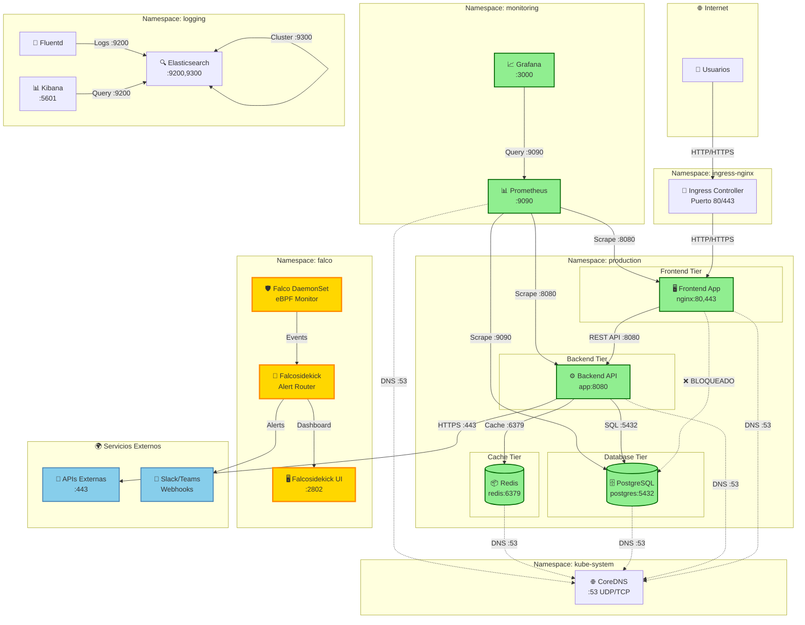

# 🌐 Diagrama de Flujos de Red

## Arquitectura de Red con Network Policies

Este diagrama muestra todos los flujos de red permitidos y bloqueados en el cluster.

## Leyenda

### Colores y Estilos

- 🟢 **Verde sólido**: Flujo PERMITIDO por Network Policy
- 🔴 **Rojo punteado**: Flujo BLOQUEADO por Network Policy
- 🟡 **Amarillo**: Componentes de seguridad (Falco)
- 🔵 **Azul claro**: Servicios externos

### Símbolos

- **→** Flecha sólida: Conexión permitida
- **⇢** Flecha punteada: Conexión bloqueada
- **↔** Doble flecha: Comunicación bidireccional

## Flujos Permitidos

### Production Namespace

| Origen | Destino | Puerto | Protocolo | Justificación |
|--------|---------|--------|-----------|---------------|
| Internet | Frontend | 80, 443 | TCP | Acceso público a la aplicación |
| Frontend | Backend | 8080 | TCP | Consumo de API REST |
| Backend | Database | 5432 | TCP | Consultas SQL |
| Backend | Redis | 6379 | TCP | Cache de datos |
| Backend | Internet | 443 | TCP | Llamadas a APIs externas |
| Todos | CoreDNS | 53 | UDP/TCP | Resolución de nombres |

### Flujos BLOQUEADOS

| Origen | Destino | Razón |
|--------|---------|-------|
| Frontend | Database | ❌ Violación de arquitectura 3-tier |
| Frontend | Redis | ❌ Solo backend puede acceder al cache |
| Internet | Backend | ❌ Backend no debe ser accesible directamente |
| Internet | Database | ❌ Database nunca debe ser pública |
| Database | Internet | ❌ Database no necesita salida a internet |

## Network