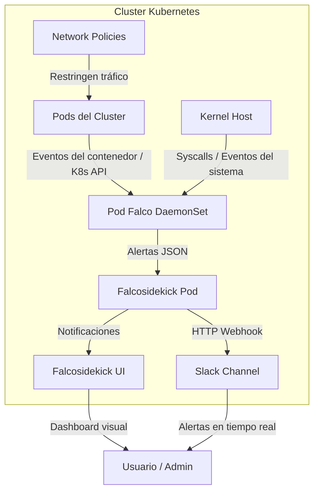
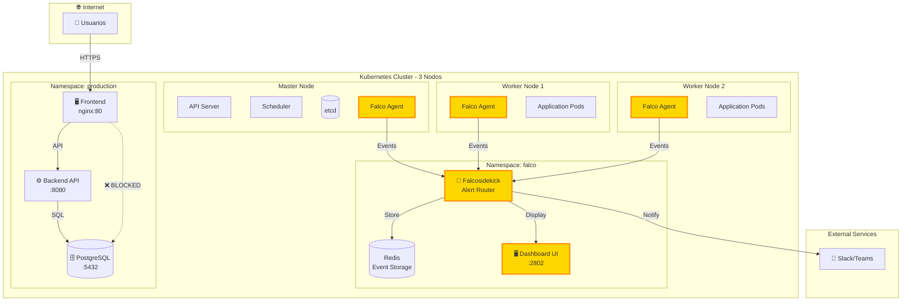
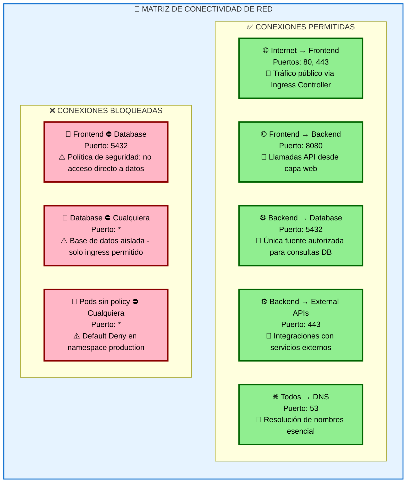

### Diagrama de Componentes (General)

```mermaid
graph TD
    subgraph Cluster Kubernetes
        F[Pods del Cluster] -->|Eventos del contenedor / K8s API| A[Pod Falco DaemonSet]
        E[Kernel Host] -->|Syscalls / Eventos del sistema| A
        A -->|Alertas JSON| B[Falcosidekick Pod]
        B -->|Notificaciones| C[Falcosidekick UI]
        B -->|HTTP Webhook| D[Slack Channel]
        G[Network Policies] -->|Restringen tráfico| F
    end
    C -->|Dashboard visual| H[Usuario / Admin]
    D -->|Alertas en tiempo real| H
```
### Diagrama de Componentes

```mermaid
graph TB
    subgraph Internet["🌐 Internet"]
        Users[👥 Usuarios]
    end
    
    subgraph Cluster["Kubernetes Cluster - 3 Nodos"]
        subgraph Master["Master Node"]
            API[API Server]
            Scheduler[Scheduler]
            ETCD[(etcd)]
            FalcoM[Falco Agent]
        end
        
        subgraph Worker1["Worker Node 1"]
            FalcoW1[Falco Agent]
            Pods1[Application Pods]
        end
        
        subgraph Worker2["Worker Node 2"]
            FalcoW2[Falco Agent]
            Pods2[Application Pods]
        end
        
        subgraph FalcoNS["Namespace: falco"]
            Falcosidekick[📢 Falcosidekick<br/>Alert Router]
            Redis[(Redis<br/>Event Storage)]
            FalcoUI[🖥️ Dashboard UI<br/>:2802]
        end
        
        subgraph ProdNS["Namespace: production"]
            Frontend[🖥️ Frontend<br/>nginx:80]
            Backend[⚙️ Backend API<br/>:8080]
            Database[(🗄️ PostgreSQL<br/>:5432)]
        end
    end
    
    subgraph External["External Services"]
        Slack[💬 Slack/Teams]
    end
    
    Users -->|HTTPS| Frontend
    Frontend -->|API| Backend
    Backend -->|SQL| Database
    Frontend -.->|❌ BLOCKED| Database
    
    FalcoM -->|Events| Falcosidekick
    FalcoW1 -->|Events| Falcosidekick
    FalcoW2 -->|Events| Falcosidekick
    Falcosidekick -->|Store| Redis
    Falcosidekick -->|Display| FalcoUI
    Falcosidekick -->|Notify| Slack
    
    classDef security fill:#FFD700,stroke:#FF8C00,stroke-width:3px
    classDef blocked fill:#FFB6C6,stroke:#8B0000,stroke-width:2px,stroke-dasharray: 5 5
    class FalcoM,FalcoW1,FalcoW2,Falcosidekick,FalcoUI security
```

### Matriz de Conectividad

```mermaid

graph TB
    subgraph Matrix["🔐 MATRIZ DE CONECTIVIDAD DE RED"]
        direction TB
        
        subgraph Allowed["✅ CONEXIONES PERMITIDAS"]
            A1["🌐 Internet → Frontend<br/>Puertos: 80, 443<br/>📝 Tráfico público via Ingress Controller"]
            A2["🌐 Frontend → Backend<br/>Puerto: 8080<br/>📝 Llamadas API desde capa web"]
            A3["⚙️ Backend → Database<br/>Puerto: 5432<br/>📝 Única fuente autorizada para consultas DB"]
            A4["⚙️ Backend → External APIs<br/>Puerto: 443<br/>📝 Integraciones con servicios externos"]
            A5["🌐 Todos → DNS<br/>Puerto: 53<br/>📝 Resolución de nombres esencial"]
        end
        
        subgraph Blocked["❌ CONEXIONES BLOQUEADAS"]
            B1["🚫 Frontend ⛔ Database<br/>Puerto: 5432<br/>⚠️ Política de seguridad: no acceso directo a datos"]
            B2["🚫 Database ⛔ Cualquiera<br/>Puerto: *<br/>⚠️ Base de datos aislada - solo ingress permitido"]
            B3["🚫 Pods sin policy ⛔ Cualquiera<br/>Puerto: *<br/>⚠️ Default Deny en namespace production"]
        end
    end
    
    classDef allowed fill:#90EE90,stroke:#006400,stroke-width:3px,color:#000
    classDef blocked fill:#FFB6C6,stroke:#8B0000,stroke-width:3px,color:#000
    classDef matrix fill:#E6F3FF,stroke:#0066CC,stroke-width:2px
    
    class A1,A2,A3,A4,A5 allowed
    class B1,B2,B3 blocked
    class Matrix matrix
```
